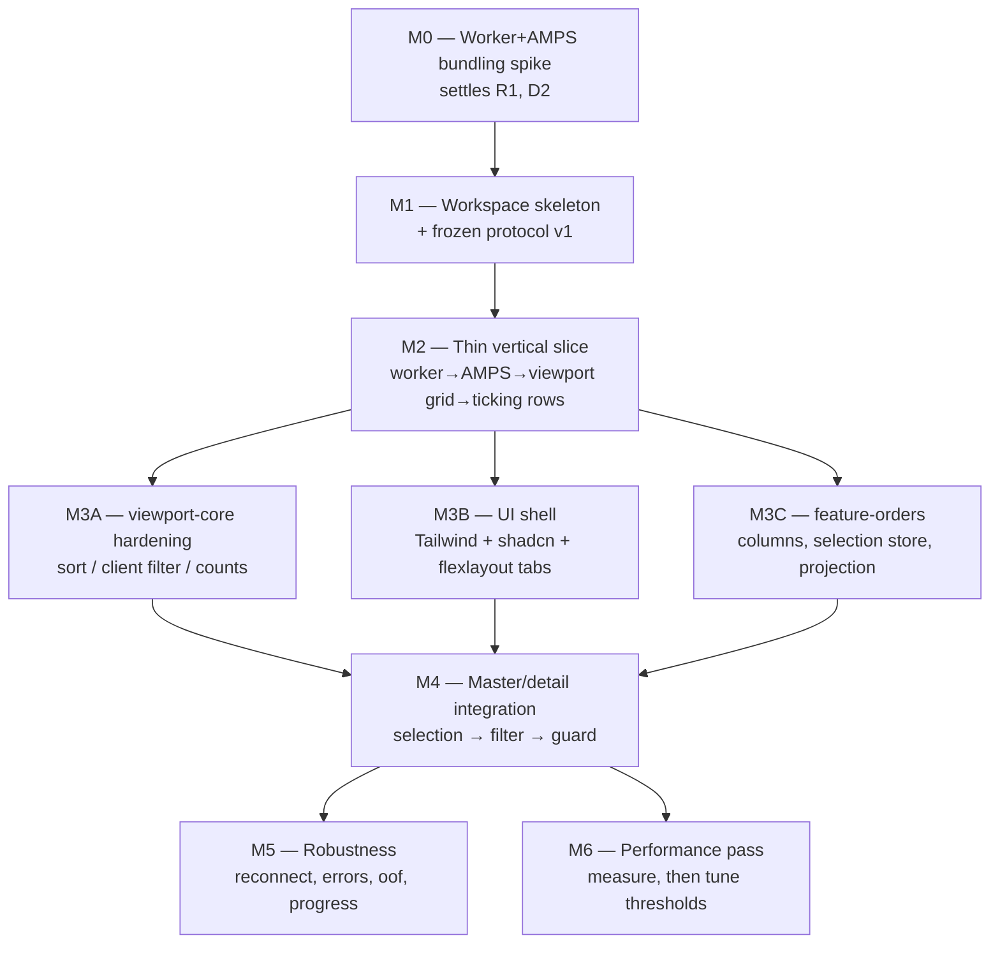

# 01 — AMPS viewport UI (React + Web Worker + AG Grid Viewport row model)

**Goal:** ship a Bun-workspace React app in which one Web Worker holds a single AMPS
connection and multiplexes subscriptions for N tabbed AG Grid viewport grids, where
multi-selecting rows in the `orders` master grid drives a live `order_details`
subscription backed by an AMPS-paginated server-side window.

Source of truth for AMPS behaviour: `/home/akhil/code/amp-server/amps-publisher/CLIENT.md`.
Verified facts, measured numbers and audit findings come from the build brief and are
used as given — this plan does not re-derive them.

## Assumptions (state these back if wrong)

- No Electron, ever. No abstraction layer "in case".
- No columnar storage engine. Row store = `Map<string, object>` of plain JS objects,
  sort index = plain `Array` of keys (brief: `Array.sort` beats `Uint32Array.sort` 3–5x
  on near-sorted data, which is the steady state here).
- No layout persistence, no user-defined column sets, no server-side views, no auth,
  no publishing. Not asked for.
- Single AMPS instance, `ws://localhost:9018/amps/json`, hardcoded in an env var.
  No failover / HA planning.
- Dev-only target: modern Chromium. No IE/Safari matrix, no SSR.
- AMPS is up right now (`orders` = 1000 valid_keys confirmed this session), so
  integration tests run against real data rather than a mock server.

## Verified environment

| item | value |
|---|---|
| bun | 1.4.0 |
| node | 24.19.0 |
| ag-grid-{community,enterprise,react} | 36.1.0 (pinned by brief) |
| react | 19.2.8 |
| flexlayout-react | 0.10.8 |
| tailwindcss | 4.3.3 |
| amps | 5.3.4-0.378635.60b2fcc (UMD/CJS only, **no ESM build**) |
| vite | 8.2.2 latest / 7.3.6 latest v7 — **see D2, this is a decision** |

---

## 1. Workspace shape

Bun workspace at `/home/akhil/code/ui/react-amps-webworker`.
Root `package.json`: `{ "workspaces": ["packages/*", "apps/*"], "private": true }`.
Scope `@amps-ui/*`. Every package is TypeScript source consumed directly by Vite
(`exports` → `./src/index.ts`); **no per-package build step**, no tsup/rollup per lib.
Type checking is one root `tsc --build` over project references.

The hard rule that drives the split: **anything that runs inside the worker must not
import React, `document`, `window`, or any DOM type.** That is enforced by giving those
packages their own `tsconfig` with `"lib": ["ES2023", "WebWorker"]` (no `"DOM"`), so a
stray DOM reference is a compile error, not a runtime surprise.

### Packages

| package | dir | owns | depends on | public surface |
|---|---|---|---|---|
| `@amps-ui/protocol` | `packages/protocol` | The main↔worker message contract, row/topic types, `SubscriptionId`/`Epoch` branded types, type guards, `PROTOCOL_VERSION`. **Zero runtime deps, zero DOM, zero React.** | — | `WorkerRequest`, `WorkerEvent` unions + `isWorkerEvent()` guards + shared literals (topic names, field lists) |
| `@amps-ui/amps-client` | `packages/amps-client` | Transport: connect with backoff, the `amps` import shim, subscription registry, snapshot lifecycle (`group_begin`/`sow`/`group_end`), delta merge, `oof`, unsubscribe, reconnect + re-snapshot. Worker-safe. | `amps`, `@amps-ui/protocol` | `AmpsConnection` class: `connect()`, `openSubscription(spec, sink)`, `closeSubscription(id)`, `onState(cb)` |
| `@amps-ui/viewport-core` | `packages/viewport-core` | Pure data engine: row `Map`, plain-`Array` sort index, comparators, client-side filter predicates, viewport window tracking, dirty-key accumulation, sparse-patch construction, row counting. No I/O, no timers of its own (clock injected). | `@amps-ui/protocol` | `RowStore`, `SortIndex`, `ViewportProjection`, `buildSparsePatch()` |
| `@amps-ui/data-worker` | `packages/data-worker` | The worker entry point. Wires `amps-client` + `viewport-core`, owns `onmessage` dispatch, epoch enforcement, and the ~16ms conflation flush. | `amps-client`, `viewport-core`, `protocol` | `src/worker.ts` (default export = the worker script) |
| `@amps-ui/worker-client` | `packages/worker-client` | Main-thread owner of the single worker: spawn, request correlation, per-subscription event fan-out, epoch allocation, connection-state store. **Framework-free** (no React) so it is unit-testable and reusable. | `protocol` | `DataClient` class + `SubscriptionHandle` |
| `@amps-ui/grid-viewport` | `packages/grid-viewport` | The reusable grid: `createWorkerViewportDatasource()` implementing `IViewportDatasource`, `<ViewportGrid>` React component, AG Grid module registration, `getRowId` wiring, rAF apply loop, sort/filter event bridging, footer/status slot. Topic-agnostic. | React, ag-grid-*, `worker-client`, `protocol` | `<ViewportGrid>`, `useViewportSubscription()` |
| `@amps-ui/ui` | `packages/ui` | shadcn/ui primitives + Tailwind v4 theme tokens shared by app and features. Owns `components.json`. | React, tailwind, radix | the shadcn components actually used (button, badge, dialog, alert, tooltip, separator, sonner) |
| `@amps-ui/feature-orders` | `packages/feature-orders` | Orders column defs, orders subscription spec, the shared selection store, `projectDetailRowCount()` from `childCount`, threshold classification. | `grid-viewport`, `ui`, `protocol` | `<OrdersGrid>`, `useOrderSelection()`, `projectDetailRowCount()` |
| `@amps-ui/feature-order-details` | `packages/feature-order-details` | Details column defs (magnitude-aware decimals, flash on the 6 ticking fields), `buildDetailsFilter(orderIds)`, selection→subscription lifecycle incl. debounce + epoch cancellation, guard banner UI. | `grid-viewport`, `ui`, `feature-orders` (selection store only), `protocol` | `<OrderDetailsGrid>`, `buildDetailsFilter()` |
| `trading-ui` (app) | `apps/trading-ui` | Vite app: flexlayout-react model + factory, tab add/close, worker bootstrap, connection banner, routing a tab to a grid instance. | everything above | — |

### Why this split and not fewer packages

- `protocol` is separate and dependency-free so it can be **frozen first** and both sides
  built in parallel against it without either agent touching the other's files.
- `amps-client` (transport) vs `viewport-core` (data structure) is the cleanest seam in
  the worker: transport is integration-tested against live AMPS, the core is 100%
  `bun test`-able with zero I/O. Two agents, no overlap.
- `worker-client` is React-free so the main-thread protocol handling is testable in
  `bun test` with a fake `Worker`, and so `grid-viewport` stays purely about AG Grid.
- Feature libs are separate from `grid-viewport` so the reusable grid never learns the
  words "orders" or "childCount".

---

## 2. Build tooling

- Vite + React 19 + TypeScript strict, one app (`apps/trading-ui`), one shared
  `vite.config.ts` base at the root re-exported by the app.
- Tailwind v4 via `@tailwindcss/vite` (not PostCSS). shadcn/ui initialised **inside
  `packages/ui`** with `components.json` pointing at that package; app and feature libs
  import from `@amps-ui/ui`. Expect to hand-fix the shadcn path aliases for the workspace
  layout — the CLI assumes a single-package app.
- ag-grid 36.1.0: `ViewportRowModelModule` comes from `ag-grid-enterprise`. Modules must
  be explicitly registered or features silently no-op. Register exactly what is used:
  `ViewportRowModelModule`, `HighlightChangesModule` (cell flash), `CustomFilterModule` /
  column filter modules as needed. Verify in M2 which of these are community vs
  enterprise rather than assuming.
- flexlayout-react 0.10.8 + its CSS import.
- `bun test` for unit + integration; no jest/vitest.
- Lint/format: `bunx biome` (single binary, no plugin zoo). Not negotiable-level
  important — swap if the team prefers eslint.

### NAMED RISK R1 — `amps` is UMD/CJS with no ESM build, inside a Vite worker bundle

This is the single most likely thing to burn a day, and it is discovered late by default
because dev and production bundle workers differently: in dev Vite serves a worker as a
native module worker, in build it emits a bundled chunk whose format is set by
`worker.format`. A CJS-only dependency can work in one and fail in the other.

**Mitigation: it is Milestone 0.** Nothing else starts until a worker in this repo has
connected to AMPS and returned a row count in **both `bun run dev` and
`bun run build && bun run preview`.** Three fallbacks, ranked, to be tried in order and
the outcome recorded in `plan/notes/M0-worker-bundling.md`:

1. `import Worker from './worker.ts?worker'`, `worker.format: 'es'`, plus
   `optimizeDeps.include: ['amps']` so the dev pre-bundler converts it to ESM.
2. `worker.format: 'iife'` + classic worker + `importScripts('/vendor/amps.js')`, with
   `node_modules/amps/amps.js` copied into `public/vendor/`. This is exactly what
   60East's own `amps-demo-positions-view-server` does, so it is known-good.
3. Vendor a one-time ESM prebuild:
   `bunx esbuild node_modules/amps/amps.js --bundle --format=esm --platform=browser --outfile=packages/amps-client/vendor/amps.esm.js`,
   import that, and re-export `amps.d.ts` for types.

Whichever wins, `@amps-ui/amps-client` exposes a **single import shim module**
(`src/amps-shim.ts`) so the choice is one file and reversible.

Related: do **not** rely on the exported `amps.IS_WEBWORKER` flag — it is declared in
`amps.d.ts` but not re-exported at runtime. The types lie.

---

## 3. The worker boundary

One `DedicatedWorker`. One `AmpsConnection`. N logical subscriptions, one per grid
instance, keyed by `subId` (derived from the flexlayout tab's instance id).

**Worker gotcha to design around:** there is no `requestAnimationFrame` in a dedicated
worker. Conflation in the worker runs on a ~16ms timer flush; the **main thread** applies
the received patch to the grid inside a real `rAF`. Two-stage, deliberately.

### Message protocol (`@amps-ui/protocol`, version 1)

Every message: `{ v: 1, type, subId?, epoch?, ... }`. Every subscription-scoped message
carries `epoch`. Epochs are allocated on the **main thread**, monotonically per `subId`,
incremented on every `sub.open` and every `sub.update`. The worker stamps outbound
messages with the epoch it is currently serving; both sides drop any message whose epoch
is lower than the current one for that `subId`. This is how a superseded snapshot is
discarded — a late `group_end` from a cancelled selection can never overwrite live state.

#### main → worker (`WorkerRequest`)

| type | payload | notes |
|---|---|---|
| `conn.open` | `{ uri, clientName }` | idempotent |
| `conn.close` | `{}` | |
| `sub.open` | `{ subId, epoch, topic, mode, filter?, orderBy?, batchSize, keyField, sort?, clientFilter? }` | `mode` = `'sow'` \| `'sow_and_subscribe'` \| `'sow_and_delta_subscribe'`. `batchSize` **must be set explicitly** — the client default is 10, far too small for bulk loads |
| `sub.update` | `{ subId, epoch, filter?, sort?, clientFilter? }` | filter change ⇒ worker re-issues to AMPS; sort/clientFilter-only change ⇒ worker re-indexes in place, no network |
| `sub.close` | `{ subId }` | |
| `sub.viewport` | `{ subId, firstRow, lastRow }` | coalesced on the main thread before send (fling protection). For a paginated subscription the worker compares this against the loaded window and re-issues with a new `skip_n` when it falls outside (debounced ~150ms) |
| `sub.window` | `{ subId, epoch, skip, take }` | explicit repage of an AMPS-paginated subscription (`options('top_n=take,skip_n=skip')`) |
| `ping` | `{ nonce }` | liveness / RTT probe |

#### worker → main (`WorkerEvent`)

| type | payload | notes |
|---|---|---|
| `conn.state` | `{ state: 'idle'\|'connecting'\|'open'\|'reconnecting'\|'closed'\|'failed', attempt?, error? }` | drives the app-level banner |
| `sub.opened` | `{ subId, epoch }` | command accepted by AMPS (NOT data-arrived) |
| `snapshot.progress` | `{ subId, epoch, received }` | throttled to ≤4/sec |
| `snapshot.complete` | `{ subId, epoch, rowCount, elapsedMs }` | emitted on `group_end` — this is the only "loaded" signal |
| `rows.patch` | `{ subId, epoch, rows: { [absoluteIndex: number]: RowData } }` | **SPARSE, absolute row index, changed rows only.** Never a whole window. This is the main performance lever |
| `rows.reset` | `{ subId, epoch, rowCount, rows }` | structural change (insert / `oof` removal / re-sort shifted indices): new count plus the **currently visible window only**, which is ~100 rows. Distinct from `rows.patch` on purpose |
| `rows.count` | `{ subId, epoch, rowCount }` | count-only change |
| `rows.removed` | `{ subId, epoch, keys: string[], rowCount }` | `oof` — row no longer matches the filter. Main thread uses it for selection cleanup; index repair rides on the accompanying `rows.reset` |
| `stats` | `{ subId, epoch, rowCount, updatesApplied, lastTickAt }` | ≤1/sec; feeds the footer and the "idle is expected" hint |
| `error` | `{ subId?, epoch?, code, message, fatal }` | never throw across the boundary; always an event |

### Worker-side update pipeline (per subscription)

1. AMPS callback fires. Branch on `message.header.command()`:
   `group_begin` → start snapshot; `sow` → `rows.set(key, data)`; `group_end` → snapshot
   complete; `p`/`publish` → **`Object.assign(existing, data)`** (delta merge — replacing
   would blank the 17 static fields); `oof` → `rows.delete(key)`.
2. Push the changed key into a `Set<string>` dirty set. Do not compute anything yet.
3. Every ~16ms, flush: map dirty keys → absolute indices via the sort index, keep only
   those inside the current viewport window (±overscan), build one sparse patch object,
   post it, clear the dirty set. Rows dirtied outside the window are dropped — they will
   be delivered fresh by `rows.reset` when the window moves over them.
4. During a snapshot, suppress per-row patches entirely; emit `snapshot.progress` only,
   then one `rows.reset` at `group_end`.

### Main-thread apply

`DataClient` receives events, drops stale epochs, and hands the current patch to the
datasource, which calls `params.setRowData(sparseMap)` / `params.setRowCount(n)` inside
a single `rAF`. Multiple patches arriving in one frame are merged into one apply.
`getRowId` is **mandatory** on every grid so RowNodes survive a re-sort with their
selection and flash state intact.

### Sorting and filtering

The viewport datasource is given no sortModel/filterModel by AG Grid. So: listen to
`sortChanged` / `filterChanged`, read `api.getColumnState()` / `api.getFilterModel()`,
translate to a `sub.update`, and let the worker re-index. Column filters are applied
**client-side inside the worker over the already-loaded row store** (decision D3 below)
— only the master-selection filter is pushed to AMPS.

---

## 4. Master/detail interaction

- Orders grid supports multi-select (viewport row model supports selection; there is no
  header-checkbox select-all and shift-click only spans the visible window — accept that,
  add an explicit "Clear selection" button, do not build a custom select-all).
- Selected order ids feed `buildDetailsFilter(ids)`:
  - 0 ids → no subscription; details grid shows an empty state.
  - 1 id → `/orderId = 'ORD-000042'` (cheaper than a 1-element IN).
  - n ids → `/orderId IN ('ORD-000042','ORD-000101')`. **Single quotes** on string
    literals, always.

### Details loading — AMPS-paginated server-side window  **[AMENDED]**

Supersedes the original three-tier size guard. The user chose "load progressively with
topN"; a spike then proved AMPS can hold the window server-side *and* keep it live, which
makes the guard unnecessary rather than merely optional.

**Verified by spike this session** (`scratchpad/ampsspike/paginate.ts`, `pagetick.ts`,
run against the live instance):

```
page0    (top_n=20, skip_n=0)    -> seq   0..19
page1    (top_n=20, skip_n=20)   -> seq  20..39
page@500 (top_n=20, skip_n=500)  -> seq 500..519
sow_and_delta_subscribe, top_n=20000, orderBy /detailId ASC:
   snapshot 20000 rows in 478ms; 724 deltas over 20s (expected ~669) -> LIVE UPDATES WORK
control, no pagination: 3353 rows -> 131 deltas (expected ~112)
```

`Command` has **no `skipN()` method**, and `topN()` is deprecated in favour of the
free-form options string. Use `.options('top_n=W,skip_n=S')`.

Why this replaces the guard entirely:

- The details grid loads a **bounded window**, not the whole selection. Memory, tick rate
  and sort cost all scale with rows-in-subscription, and `top_n` bounds exactly that.
  Selecting all 1,000 orders (1,493,999 rows) therefore costs the same as selecting one.
- **Sorting is delegated to AMPS** via `orderBy`, so we never sort 1.5M rows in JS. This
  removes the sort index from the details path entirely. (The orders grid — 1,000 static
  rows — still sorts client-side.)
- **The total row count stays exact.** `sum(childCount)` over the selection is
  authoritative and independent of what was fetched, so the footer shows the true total
  even though only a window is loaded. Verified exact: 3 orders, expected 2537 == actual 2537.
- **No hard block, no "trim to fit", no `DETAILS_LIMITS` refusal.** Large selections load
  progressively. Nothing is ever refused.

Window management:

- `WINDOW_ROWS` = 2,000 to start (20,000 measured at 478ms, so ~50ms expected). Tune in M6.
- The window covers the viewport plus generous overscan. When `setViewportRange` moves
  outside the loaded window, re-issue with a new `skip_n`, debounced ~150ms so a scroll
  fling does not thrash. This is block-loading like the Infinite row model, but with live
  ticks inside the block.
- **Sort-key RANK VOLATILITY matters — and `oof` is NOT the eviction mechanism.**
  CORRECTED after measurement; an earlier draft of this section was wrong. Measured,
  `top_n=1000`, no filter, 15s each, topic ticking ~2500/s (window-bounded would be ~1.7/s):

  | orderBy | in-window ticks | new rows pushed in | `oof` | observed rate | bounded? |
  |---|---|---|---|---|---|
  | `/detailId ASC` (static) | 25 | 0 | 0 | 2/s | YES |
  | `/markPrice DESC` (live) | 22 | 6 | 0 | 2/s | YES |
  | `/lastUpdated DESC` (live) | 500 | 37,748 | 0 | 2550/s | **NO** |

  Two rules follow, and both are load-bearing:

  1. **AMPS NEVER sends `oof` for a row displaced out of a paginated window.** Zero `oof`
     across all three trials, including the 37,748-row case. `oof` means only "no longer
     matches the FILTER", never "fell out of the top-N". **The client MUST trim the window
     itself** by maintaining the sort order and dropping rows past `top_n`. Any design that
     waits for `oof` to bound the row store will grow without limit.
  2. **What bounds the live stream is how often the sort key changes a row's RANK**, not
     whether the column is "live". `markPrice` is a capped mean-reverting walk, so entering
     the top-1000 is rare (6 rows in 15s) and the window stays bounded. `lastUpdated` and
     `tickSeq` are *recency* fields — every tick sets them to the newest value, so every
     update instantly qualifies for the top-N and the subscription degenerates to the full
     topic rate (2550/s, 38k rows in 15s).

  **Therefore: sorting a paginated details subscription by `lastUpdated` or `tickSeq` MUST
  NOT stream.** Either disable server-sort for those columns and re-issue a bounded snapshot
  on demand, or refuse them. Everything else (`detailId`, `seq`, `execId`, `venue`,
  `markPrice`, `unrealizedPnl`, `marketValue`, `dayPnl`) is safe. Default sort stays
  `/detailId ASC`.
- The footer must distinguish **"N rows"** (true total from `childCount`) from
  **"window S..S+W loaded"**, so a partial view is never mistaken for the whole set.

### Delta payload shape — do NOT assume 7 fields

The spike observed deltas of **both 7 and 6 fields**: not every tick moves all six ticking
fields. Merge strictly by name with `Object.assign`. Never assume which fields are present,
never index by position (CLIENT.md: field order is not stable), and never replace the
record (it would blank the 17 static fields).

### Debounce and cancellation

- Selection changes are debounced **250ms trailing** before anything is issued — arrow-
  keying down the orders grid must not thrash subscriptions.
- On firing: bump the details `epoch`, send `sub.update` (worker unsubscribes the old
  AMPS subscription and issues the new one). Any in-flight snapshot from the previous
  epoch is discarded on arrival by the epoch check on both sides.
- The old rows stay on screen with a loading overlay until the new `snapshot.complete`
  arrives, then swap atomically. No blank grid between selections.

---

## 5. Tabs

- flexlayout-react model: one row, one tabset, two tabs at startup — "Orders"
  (`component: "grid"`, `config: { kind: "orders", instanceId }`) and "Order Details"
  (`config: { kind: "order-details", instanceId }`).
- `instanceId = crypto.randomUUID()` at tab creation. **One tab = one grid instance = one
  `subId` in the worker.** The mapping is exactly `subId === instanceId`; no registry
  needed beyond the worker's own `Map`.
- The factory function switches on `config.kind` and renders `<OrdersGrid>` or
  `<OrderDetailsGrid>` with that `instanceId`.
- **"Add tab" CLONES THE ACTIVE TAB** (user decision, supersedes the earlier
  Orders/Order-Details dropdown). `Actions.addNode(...)` copies the active tab's `kind`
  **and a snapshot of its current selection / filter / sort**, with a fresh `instanceId`
  and therefore a fresh `subId`. The clone then diverges: it is fully independent from
  the moment it is created.
- **Selection is PER-TAB, not global** (supersedes D4). A cloned details tab that followed
  a single shared selection would always show data identical to its source, making clone
  pointless. Each tab owns its own selection state; cloning copies it once.
- Tab close is intercepted via `onAction` on `Actions.DELETE_TAB` → `sub.close(subId)`
  before letting the action through. Closing a tab must release the AMPS subscription.
- **Footer row count per tab** is sourced from that tab's own `stats` / `rows.count`
  events, i.e. what the subscription actually delivered — *not* from
  `sow.json`. The footer also shows: snapshot progress while loading, updates/sec, and
  the age of the last tick, so that a legitimately quiet narrow filter reads as "idle,
  expected" rather than "broken" (a given row ticks ~once per 10 minutes).
- Layout persistence is **out of scope**. Not asked for.

---

## 6. Testing and verification

### `bun test`, pure, no browser, no network — the bulk of it

- `protocol`: type guards, epoch ordering helper.
- `feature-order-details`: `buildDetailsFilter()` — quoting, the 0/1/n branches, escaping,
  filter-string length with a large id list.
- `feature-orders`: `projectDetailRowCount()` == `sum(childCount)` over the selection.
- `feature-order-details`: window/skip arithmetic — mapping a viewport range to the
  `(skip_n, top_n)` that covers it plus overscan, and deciding when a range change needs a
  repage versus is already covered.
- `viewport-core`: the sparse-update reducer (dirty keys → sparse map keyed by absolute
  index; rows outside the window dropped); index repair after an `oof` removal;
  comparators and sort stability; re-sort of a near-sorted index; viewport window math and
  overscan; conflation/debounce with an injected clock.
- `amps-client`: delta merge semantics — `Object.assign` preserves the 17 static fields,
  a naive replace does not (make that an explicit regression test).
- `worker-client`: request correlation and stale-epoch dropping against a fake `Worker`.

### `bun test`, integration, against the LIVE instance (it is up now)

Tagged separately (`bun test integration/`) so they can be skipped when AMPS is down.
`WebSocket` is a Bun global, so `@amps-ui/amps-client` runs unmodified outside a browser.

- connect to `ws://localhost:9018/amps/json`.
- `sow` on `orders` → exactly 1000 rows at `group_end` (verified count).
- `sow_and_delta_subscribe` on `order_details` filtered to one order → snapshot messages
  carry 23 fields, subsequent `p` messages carry 7. Assert that shape; it is the whole
  justification for the delta mode.
- `execute()` resolves before data arrives — assert the returned value is an id, not rows.
- `oof` path: subscribe with a `/markPrice` range filter narrow enough that ticking rows
  leave it, assert an `oof` is received. If this proves flaky in practice, downgrade to a
  manual check and say so — do not chase it.
- disconnect → reconnect → re-subscribe → re-snapshot.

### Browser-only, cannot be `bun test`

- **R1: the worker bundle works in dev AND in build+preview.** M0 gate.
- AG Grid viewport rendering, scroll fling, cell flash, selection surviving a re-sort.
- flexlayout tab add/close/drag.
- Frame rate and heap under load.

Method: manual checklist per milestone plus one scripted probe page (`/perf`) that
subscribes to a known-large order, samples `performance.memory` and frame timing, and
prints patch sizes. No Playwright/Cypress unless the team asks (D8).

---

## 7. Phasing



Strictly sequential: **M0 → M1 → M2 → (M3 fan-out) → M4**.
Parallel: **M3A / M3B / M3C** (three agents, disjoint directories).
M5 and M6 can also run in parallel with each other once M4 lands.

### M0 — Bundling spike (BLOCKS EVERYTHING) · 1 agent

Throwaway-quality Vite app + one worker. The worker imports `amps`, connects, runs `sow`
on `orders`, posts `{ count }` back to the page.
**Done when:** the page prints `1000` under `bun run dev` *and* under
`bun run build && bun run preview`, and `plan/notes/M0-worker-bundling.md` records which
of the three R1 fallbacks was used, the exact vite worker config, and the Vite major
chosen (D2). Nothing else may start before this.

### M1 — Workspace skeleton + frozen protocol · 1 agent (same agent as M0)

Root `package.json` workspaces, root `tsconfig` with project references, shared vite
config carrying M0's worker settings, biome config, all ten package directories with
stub `src/index.ts` and correct `tsconfig` (worker-side packages get no `"DOM"` lib),
and `@amps-ui/protocol` written **in full** — every message type from §3.
**Done when:** `bun install` resolves the workspace, `bun run typecheck` passes across
all packages, `bun test` runs (zero tests is fine), and the protocol package is declared
frozen. Freezing it is what unlocks parallel work later.
*File ownership: this agent alone touches root config files, for the whole project.*

### M2 — Thin vertical slice: ticking rows on screen · 2 agents (worker side / main side)

The riskiest end-to-end path, proven on one hardcoded case before any breadth.
Scope: `sow_and_delta_subscribe` on `order_details` filtered to **one hardcoded order
with `childCount ≥ 5000`** (so ~8–17 updates/sec are visibly flashing — pick it by
querying `orders` with `orderBy('/childCount DESC').topN(5)`), rendered through the real
`IViewportDatasource` with sparse patches, `getRowId`, and cell flash on `markPrice`.
No tabs, no shadcn, no orders grid, no selection — one full-window grid on a bare page.

- Agent A (worker side): `amps-client` subscribe path + `viewport-core` store/sort
  index/patch builder + `data-worker` entry and its 16ms flush.
- Agent B (main side): `worker-client` + `grid-viewport` datasource, rAF apply, module
  registration, `<ViewportGrid>`; consumes the frozen protocol, so A and B never share a
  file.

**Done when:** the grid shows N rows, scrolls smoothly, and cells visibly flash as ticks
arrive; DevTools shows patch messages containing only changed rows (not whole windows);
and the row store is confirmed to be receiving 7-field deltas, not 23-field records.

### M3A — viewport-core hardening · 1 agent · parallel

Column sort via `sortChanged` → `sub.update` → re-index (plain `Array.sort`), client-side
column filtering over the loaded store, accurate `rowCount` through filter changes, `oof`
index repair, `setViewportRange` coalescing on the main thread, and the full `bun test`
suite for all of it.
**Done when:** sorting and filtering the M2 grid is correct and does not lose selection
or flash state, and every pure rule in §6 has a test.

### M3B — UI shell · 1 agent · parallel

Tailwind v4 + shadcn init in `@amps-ui/ui`, app chrome, flexlayout model + factory +
add-tab dropdown + close interception, the footer component (fed by a mock stats source),
and the connection-state banner. No AMPS data at all.
**Done when:** two tabs render placeholder panels, tabs can be added, dragged, and
closed, and closing one calls a stubbed `sub.close`.

### M3C — feature-orders · 1 agent · parallel

Orders column defs (24 fields, sensible widths and formatters), the orders subscription
spec (`sow_and_subscribe` on `orders`, explicit `batchSize`, no filter — 1000 rows is
safe unfiltered), the per-tab selection store, `projectDetailRowCount()` (exact,
from `childCount`), all unit tested.
**Done when:** an orders grid renders 1000 real rows through the M2 grid component,
multi-select works, and the exact projected detail row count updates live as selection
changes (assert it equals `sum(childCount)`; verified exact against live AMPS).

### M4 — Master/detail integration · 1 agent

Bring M3A/B/C together in `apps/trading-ui`: orders tab and details tab live in
flexlayout, selection drives `buildDetailsFilter`, 250ms debounce, epoch-based
cancellation of superseded snapshots, the AMPS-paginated window (`sub.window` repaging on
scroll, 150ms debounce), per-tab footer counts showing true total vs loaded window, and
tab cloning with independent per-tab selection.
**Done when:** clicking and multi-selecting orders repopulates the details grid with live
ticking rows; rapid arrow-keying issues exactly one subscription; **selecting all 1,000
orders (1,493,999 rows) loads and scrolls without hanging the tab**; scrolling past the
loaded window repages; cloning a tab yields an independent selection; each tab's footer
shows its own true total and loaded window.

### M5 — Robustness · 1 agent · parallel with M6

Reconnect with exponential backoff (0.5s→8s, new `Client` instance each attempt — never
retry a failed instance), re-issue **and re-snapshot** every live subscription on
reconnect (subscriptions do not survive), error events surfaced as shadcn toasts,
snapshot progress in the footer, `oof` removal verified against live data, the "quiet is
expected" hint, and clean teardown on tab close and page unload.
**Done when:** stopping and restarting the AMPS instance leaves every open tab correctly
repopulated with no manual refresh and no duplicate subscriptions.

### M6 — Performance pass · 1 agent · parallel with M5

Measure, then tune — in that order. The `/perf` probe at projections of ~1k / ~10k /
~100k rows: frame time during scroll, heap after snapshot, patch message size and rate,
time-to-first-row and time-to-`group_end`. Adjust the conflation interval, overscan,
`batchSize`, `WINDOW_ROWS` and the repage debounce **against those measurements**, not
against intuition.
**Done when:** a ~100k-row details subscription scrolls at 60fps with the grid ticking,
and the numbers are written into `plan/notes/M6-measurements.md`. If a measurement
contradicts one of this plan's assumptions, that is a finding to raise, not to silently
patch around.

---

## 8. Open decisions — need sign-off before or during the milestone shown

| # | decision | needed by | recommendation |
|---|---|---|---|
| D1 | ~~ag-grid-enterprise licence key~~ **RESOLVED: no key; watermark accepted.** Wire `LicenseManager.setLicenseKey` behind `VITE_AG_GRID_LICENSE_KEY` so a key can be dropped in later without a code change. Never commit a key. | — | **done** |
| D2 | **Vite 7.3.6 vs 8.2.2.** Vite 8 (2026-03-12) is Rolldown-based (`rolldown ~1.2.4`), a different CJS-interop path from Rollup+esbuild — directly relevant to R1. | M0 | pin **7.3.6** for M0; revisit only if something needs v8 |
| D3 | **Column filters: client-side over the loaded store, or pushed into the AMPS filter?** Client-side is simpler and instant but only filters what is loaded, which changes what the footer "total" means. Server-side is exact but re-snapshots on every keystroke. | M3A | client-side, and label the footer count "rows in subscription" |
| D4 | ~~shared vs pinned selection~~ **RESOLVED: per-tab selection.** Required by the clone-tab decision — see §5. | — | **done** |
| D5 | ~~Guard thresholds 25,000 / 100,000~~ **WITHDRAWN.** The paginated window makes the guard unnecessary; `WINDOW_ROWS` replaces it and is a pure performance tuning constant, not a refusal threshold. | — | **done** |
| D6 | **Master grid on the Viewport row model** (brief's lean) even though 1,000 static rows do not need it. It costs re-implementing sort and filter for that grid. Client-side row model would be free. | M3C | follow the brief — consistency and it exercises the shared component |
| D7 | **Does `HighlightChangesModule` require enterprise in 36.1.0?** Verify rather than assume; if enterprise-only and D1 says no key, cell flash still works but under the watermark. | M2 | verify in M2 |
| D8 | **Any browser test runner (Playwright), or manual checklist + `/perf` probe?** | M6 | manual + probe; adding Playwright is scope the user did not ask for |

## 9. Explicitly out of scope

Electron or any abstraction toward it. A columnar storage engine, typed-array row
storage, or SharedArrayBuffer transfer. Layout persistence. Server-side AMPS Views or
aggregated topics. Authentication. Publishing to AMPS. HA/failover across instances.
The sibling 9007/9008/8085 instance. "Zero-allocation" decoding — the JSON TypeHelper
runs `JSON.parse` before any handler is called, so it is not achievable without replacing
the type helper, and it is not worth it.

---

## 10. Carry-forward items for M4 (raised by milestone agents, not yet resolved)

Recorded so they are not lost between agents. None are blocking; all are additive.

| # | item | raised by | action required in M4 |
|---|---|---|---|
| C1 | **`buildDetailsFilter` is duplicated.** A tested implementation lives in `packages/feature-orders/src/details-filter.ts`; a **throwing stub** of the same name is still exported from `packages/feature-order-details/src/index.ts`. Plan §1 assigns the helper to `feature-order-details`. | M3C | Pick ONE home and delete the other. Simplest: delete the stub and re-export from `feature-orders`, since that version has tests. Do not reimplement — the tested one covers 0/1/n branches, single-quote escaping, and a 250-id list. |
| C2 | **`<ViewportGrid>` exposes no selection surface.** It has no `rowSelection` / `onSelectionChanged` props, so `<OrdersGrid>` cannot drive `OrderSelectionStore` from AG Grid's row selection. Master→details is impossible until this exists. | M3C | Add selection props to `packages/grid-viewport`. Additive, not a redesign — `OrderSelectionStore` is already built and tested standalone. Remember Viewport row model limits: no header-checkbox select-all, and shift-click only spans the loaded window. Add an explicit "Clear selection" control rather than building a custom select-all. |
| C3 | **Protocol v2 bump.** M3A closes two v1 gaps (`ping` with no `pong`; loosely-typed `SortSpec`/`ClientFilterSpec`). Main-thread packages (`worker-client`, `grid-viewport`) consume these types. | M2 agents / M3A | After M3A reports, update the main-thread side to match v2. `protocol` must stay zero-dependency — AG Grid model translation belongs on the main-thread side, never inside `protocol`. |
| C4 | ~~M2 never verified in a browser~~ **RESOLVED — M2 VERIFIED, gate closed.** Chromium-in-WSL was the wrong approach: this is Windows+WSL2 and Chrome lives on Windows. Verified by driving Windows Chrome (headless) against the WSL dev server via localhost forwarding, with CDP bridged by a PowerShell TCP relay (Chrome ignores `--remote-debugging-address` and binds loopback, which WSL2 NAT cannot reach). Results on `?m2` against live AMPS: **connection open** (so `amps` UMD/CJS DOES load and connect inside a Vite-bundled worker — the M0 risk is retired), **exactly 9,968 rows**, snapshot **2,484ms**, static fields (`venue`/`execId`/`counterparty`) intact through delta merges, magnitude-aware decimals correct (VOD.L at 4dp, under 10), and **cell flash confirmed** via MutationObserver (3 `ag-cell-data-changed` applications in 45s). Only console errors are the expected AG Grid licence watermark. | QA | **Method captured as the `wsl-chrome-debugging` skill.** Two traps recorded there: `--virtual-time-budget` fast-forwards the clock so live WebSocket data appears missing and the app looks broken when it is fine; and polling for transient effects like a ~500ms cell flash is inconclusive — use a MutationObserver. |
| C5 | ~~Could not reproduce live-column `oof` churn~~ **RESOLVED — M3A was right, the original §4 claim was wrong.** Measured directly (`top_n=1000`, no filter, 15s per ordering): AMPS sends **zero `oof` for displacement** in every case, including one where 37,748 rows displaced others. `oof` means only "no longer matches the FILTER". Separately, what bounds the live stream is **rank volatility**, not liveness: `/markPrice DESC` stayed bounded (6 new rows/15s) while `/lastUpdated DESC` degenerated to the full topic rate (2550/s). §4 has been corrected with the measurements. | M3A | **Two hard requirements for M4:** (1) the client MUST trim the window itself by sort order — never wait for `oof`, or the row store grows without bound; (2) `lastUpdated` and `tickSeq` MUST NOT be used as a streaming server-sort key — disable or re-issue on demand. |
